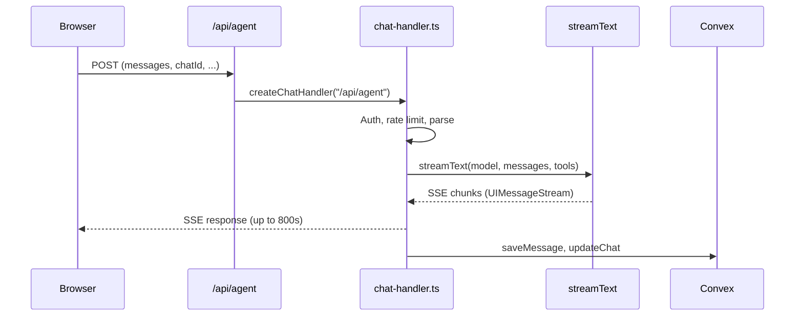
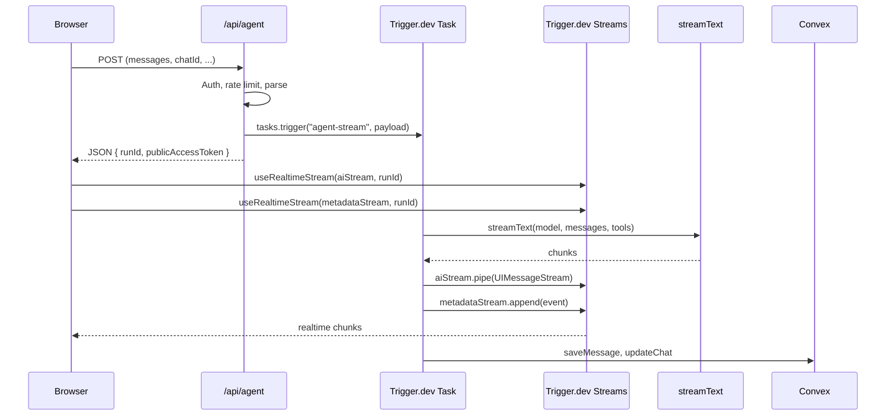

# Integrate Trigger.dev for Agent Mode Streaming

## Current Architecture



The problem: Vercel's `maxDuration: 800` kills long agent conversations. The route in [app/api/agent/route.ts](app/api/agent/route.ts) delegates to `createChatHandler` in [lib/api/chat-handler.ts](lib/api/chat-handler.ts), which does auth, rate limiting, LLM streaming, and persistence all within one serverless invocation.

## Target Architecture



---

## Phase 1 -- Foundation (Steps 1-2)

### Step 1: Install missing package and verify config

- Install `@trigger.dev/react-hooks` (the only missing package; `@trigger.dev/sdk` 4.3.3 and `@trigger.dev/build` 4.3.3 are already installed)
- Add `TRIGGER_SECRET_KEY` to `.env.local`
- [trigger.config.ts](trigger.config.ts) is already configured with `project: "proj_umgzqxmfrucveonxqdmt"`, `dirs: ["./src/trigger"]`, and `maxDuration: 3600`
- Disable retries for the agent task (streaming tasks should not auto-retry; the current config has `maxAttempts: 3` which is wrong for streaming)
- Delete [src/trigger/example.ts](src/trigger/example.ts)

### Step 2: Define shared stream types

Create `src/trigger/streams.ts`:

```typescript
import { streams } from "@trigger.dev/sdk";
import type { UIMessageChunk } from "ai";

// Main LLM output stream -- typed as UIMessageChunk for direct
// compatibility with the AI SDK's toUIMessageStream()
export const aiStream = streams.define<UIMessageChunk>({ id: "ai" });

// Metadata sideband stream -- discriminated union for all custom data parts
export type MetadataEvent =
  | { type: "data-title"; data: { chatTitle: string } }
  | {
      type: "data-upload-status";
      data: { message: string; isUploading: boolean };
    }
  | {
      type: "data-summarization";
      data: { status: "started" | "completed"; message: string };
    }
  | { type: "data-rate-limit-warning"; data: RateLimitWarningData }
  | {
      type: "data-file-metadata";
      data: { messageId: string; fileDetails: any[] };
    }
  | {
      type: "data-sandbox-fallback";
      data: {
        occurred: boolean;
        reason?: string;
        originalType?: string;
        fallbackType?: string;
      };
    };

export const metadataStream = streams.define<MetadataEvent>({ id: "metadata" });
```

The `RateLimitWarningData` type is imported from [lib/utils/stream-writer-utils.ts](lib/utils/stream-writer-utils.ts) (already defined there as a discriminated union of `sliding-window`, `token-bucket`, and `extra-usage-active` variants).

---

## Phase 2 -- Backend (Steps 3-4)

### Step 3: Create the Trigger.dev task

Create `src/trigger/agent-task.ts`. This is the bulk of the work -- extracting the `createUIMessageStream.execute(({ writer }) => { ... })` block (lines ~310-1044 of [lib/api/chat-handler.ts](lib/api/chat-handler.ts)) into a Trigger.dev task.

**Payload shape** (all auth/rate-limit checking stays in the route):

```typescript
type AgentTaskPayload = {
  chatId: string;
  messages: UIMessage[]; // processChatMessages output
  systemPrompt: string; // pre-built system prompt
  assistantMessageId: string;
  mode: ChatMode;
  todos: Todo[];
  regenerate: boolean;
  temporary: boolean;
  sandboxPreference: SandboxPreference;
  userId: string;
  subscription: SubscriptionTier;
  userLocation: string | null;
  extraUsageConfig: ExtraUsageConfig | null;
  estimatedInputTokens: number;
  memoryEnabled: boolean;
  userCustomization: string | null;
  isNewChat: boolean;
  selectedModel: SelectedModel;
  rateLimitInfo: RateLimitInfo; // for sending warnings via metadataStream
};
```

**Inside the task `run` function:**

- Build tools via `createTools()` (from [lib/ai/tools.ts](lib/ai/tools.ts))
- Call `streamText({ model, messages, tools, ... })` -- same logic as current handler
- Pipe LLM output: `aiStream.pipe(result.toUIMessageStream({ generateMessageId: () => assistantMessageId }))`
- For every point where `writer.write({ type: "data-*", ... })` is called today, instead call `metadataStream.append({ type: "data-*", data: ... })`
- Title generation: call `generateTitleFromUserMessage()` directly (from [lib/actions/index.ts](lib/actions/index.ts)), then `metadataStream.append({ type: "data-title", ... })`
- On completion: `saveMessage()`, `updateChat()`, `deductUsage()` -- same post-stream Convex persistence logic
- Replace `createPreemptiveTimeout` -- no longer needed (Trigger.dev has `maxDuration: 3600`)
- Replace Redis cancellation -- Trigger.dev tasks are cancelled natively

**Key refactoring approach for `chat-handler.ts`:**

- Extract the pure "stream execution" logic into a shared helper (e.g., `lib/api/agent-stream-logic.ts`) that accepts either a `UIMessageStreamWriter` or Trigger.dev stream abstractions
- Alternatively, create the task as a self-contained copy initially, then DRY up later
- The second approach is recommended to reduce risk -- the existing `createChatHandler` for ask mode stays completely untouched

### Step 4: Rewrite `/api/agent` route

Rewrite [app/api/agent/route.ts](app/api/agent/route.ts):

```typescript
import { tasks, auth } from "@trigger.dev/sdk/v3";
import type { agentStreamTask } from "@/src/trigger/agent-task";

export async function POST(req: Request) {
  // 1. Keep all fast pre-stream logic from chat-handler:
  //    - parseRequestBody, getUserIDAndPro, checkRateLimit
  //    - getMessagesByChatId, handleInitialChatAndUserMessage
  //    - processChatMessages, token counting, model selection

  // 2. Trigger the task
  const handle = await tasks.trigger<typeof agentStreamTask>(
    "agent-stream",
    validatedPayload,
  );

  // 3. Create public access token for frontend stream subscription
  const publicAccessToken = await auth.createPublicToken({
    scopes: {
      read: { runs: [handle.id] },
    },
  });

  // 4. Return JSON (route completes in <1s)
  return Response.json({
    runId: handle.id,
    publicAccessToken,
  });
}
// No more maxDuration = 800
```

The pre-stream logic (~lines 88-308 of chat-handler.ts) needs to be either:

- Extracted into a reusable helper from `createChatHandler` so both the ask-mode handler and the new agent route can share it, OR
- Duplicated into the new route (simpler but more maintenance)

Recommended: extract a `prepareAgentPayload(req)` helper that returns the validated payload, then call it from the new route.

---

## Phase 3 -- Frontend (Steps 5-6)

### Step 5: Add Trigger.dev streaming path in chat.tsx

This is the highest-risk phase. In [app/components/chat.tsx](app/components/chat.tsx):

**New state:**

```typescript
const [triggerRun, setTriggerRun] = useState<{
  runId: string;
  publicAccessToken: string;
} | null>(null);
```

**Agent mode submit flow (when `chatMode === "agent"`):**

- Instead of going through `useChat`'s transport, intercept the submit
- POST to `/api/agent` with the same payload
- Store `{ runId, publicAccessToken }` in state

**Consume streams with two `useRealtimeStream` hooks:**

```typescript
const { parts: aiParts } = useRealtimeStream(aiStream, triggerRun?.runId, {
  accessToken: triggerRun?.publicAccessToken,
  enabled: !!triggerRun,
  throttleInMs: 100, // match existing experimental_throttle: 100
  timeoutInSeconds: 600,
});

const { parts: metaParts } = useRealtimeStream(
  metadataStream,
  triggerRun?.runId,
  {
    accessToken: triggerRun?.publicAccessToken,
    enabled: !!triggerRun,
    onData: (event) => {
      /* process same as current onData */
    },
  },
);
```

**Build messages state from aiParts:**

- `aiParts` is `UIMessageChunk[]` -- accumulate into a `ChatMessage[]` array matching what `useChat` produces
- The AI SDK provides `processUIMessageStream` or similar utilities to reconstruct messages from chunks; alternatively, manual accumulation by processing each chunk type (text-delta, tool-call, tool-result, reasoning, data-)
- This reconstructed `messages` array is passed to `Messages` component when in agent mode

**Derive `status` for agent mode:**

- Use `useRealtimeRun` to get the Trigger.dev run status
- Map: `EXECUTING` -> `"streaming"`, `COMPLETED` -> `"ready"`, `FAILED` -> `"error"`
- This ensures `Messages`, `ChatInput`, and loading indicators work without changes

**Stop/cancel for agent mode:**

- Import `runs` from `@trigger.dev/sdk`
- Call `runs.cancel(triggerRun.runId)` instead of `stop()` from useChat

**Message queue adaptation (lines 524-577):**

- When a Trigger.dev run completes (status becomes `"ready"`), process the next queued message by triggering a new run

### Step 6: Messages / MessageItem unchanged

[app/components/Messages.tsx](app/components/Messages.tsx) and [app/components/MessageItem.tsx](app/components/MessageItem.tsx) receive `messages: ChatMessage[]` and `status: ChatStatus` -- no changes needed as long as Step 5 produces the same shapes.

---

## Phase 4 -- Polish (Steps 7-8)

### Step 7: Edge cases

- **Temporary chats:** Keep on Vercel initially (shorter runs, no Trigger.dev overhead). Add a `useTemporaryFallback` flag that routes temporary agent chats through the existing `useChat` path
- **Regenerate:** For agent mode, trigger a new Trigger.dev run with the regeneration payload
- **Resume stream:** Leverage Trigger.dev's 28-day stream retention and automatic resumption
- **Existing chat loading:** Continue using Convex-based message reload (Trigger.dev streams are supplementary, not the source of truth for persisted messages)

### Step 8: Testing

- **Unit tests:** Mock `tasks.trigger()` in route tests; mock `useRealtimeStream` in component tests
- **E2E:** Update [e2e/chat-agent.spec.ts](e2e/chat-agent.spec.ts) -- agent mode now returns JSON then streams via Trigger.dev
- **Manual:** Test long-running multi-step agent conversations (60s+) to confirm no timeouts
- **Regression:** Verify ask mode is completely untouched (same route, same transport, same hooks)

---

## Files Changed Summary

- **New files:**
  - `src/trigger/streams.ts` -- stream definitions
  - `src/trigger/agent-task.ts` -- Trigger.dev task
  - `lib/api/prepare-agent-payload.ts` -- extracted pre-stream logic (shared by ask/agent routes)
- **Modified files:**
  - `app/api/agent/route.ts` -- rewritten to trigger task + return JSON
  - `app/components/chat.tsx` -- add Trigger.dev streaming path for agent mode
  - `lib/api/chat-handler.ts` -- extract pre-stream logic into shared helper
  - `trigger.config.ts` -- disable retries for agent task
  - `package.json` -- add `@trigger.dev/react-hooks`
- **Deleted files:**
  - `src/trigger/example.ts`
- **Unchanged files:**
  - `app/api/chat/route.ts`, `app/components/Messages.tsx`, `app/components/MessageItem.tsx`, `lib/utils/stream-writer-utils.ts`, `lib/utils/stream-cancellation.ts`
